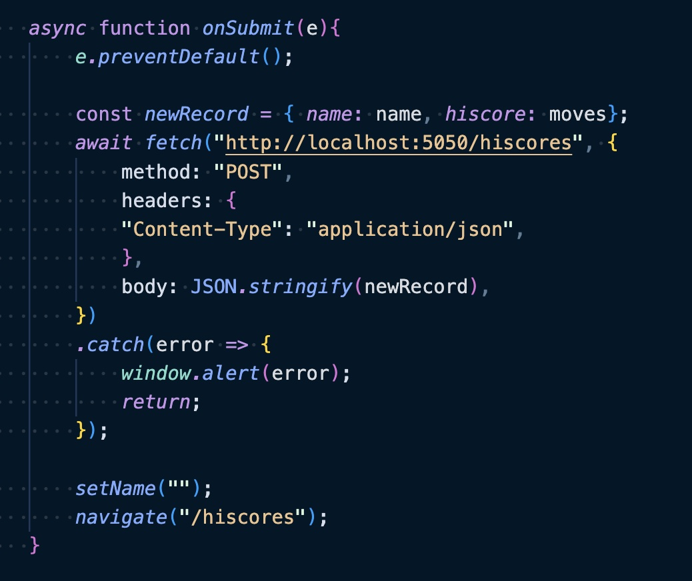
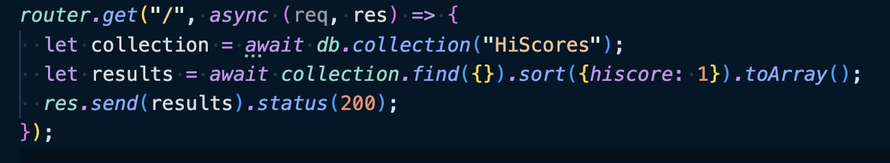
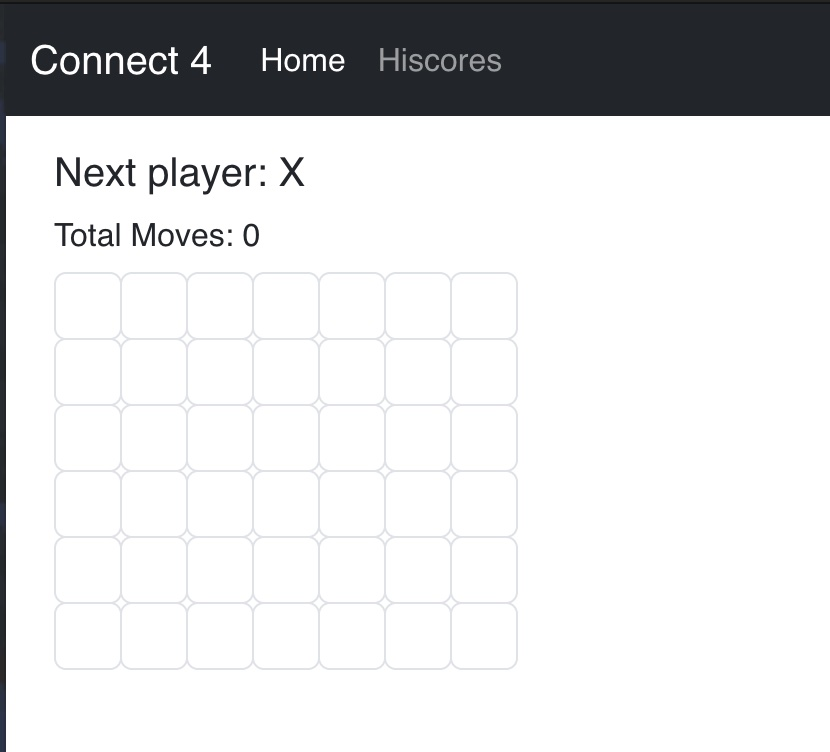
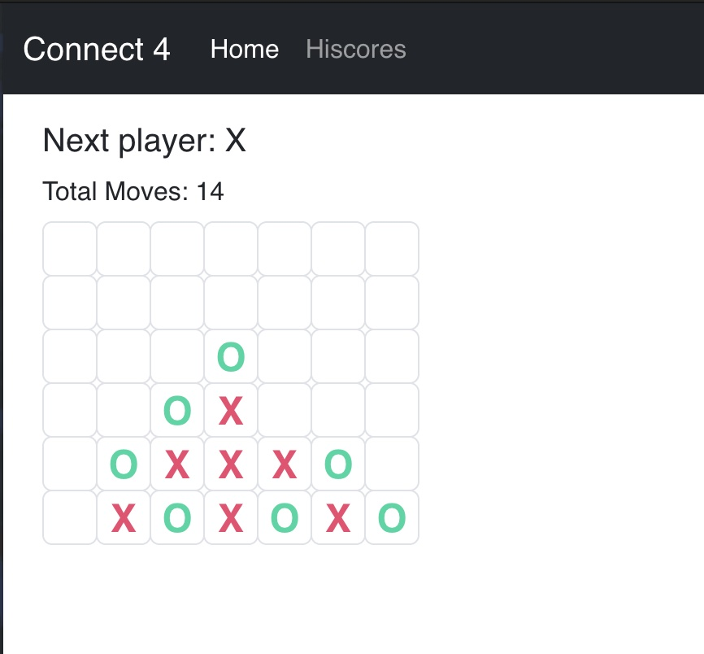
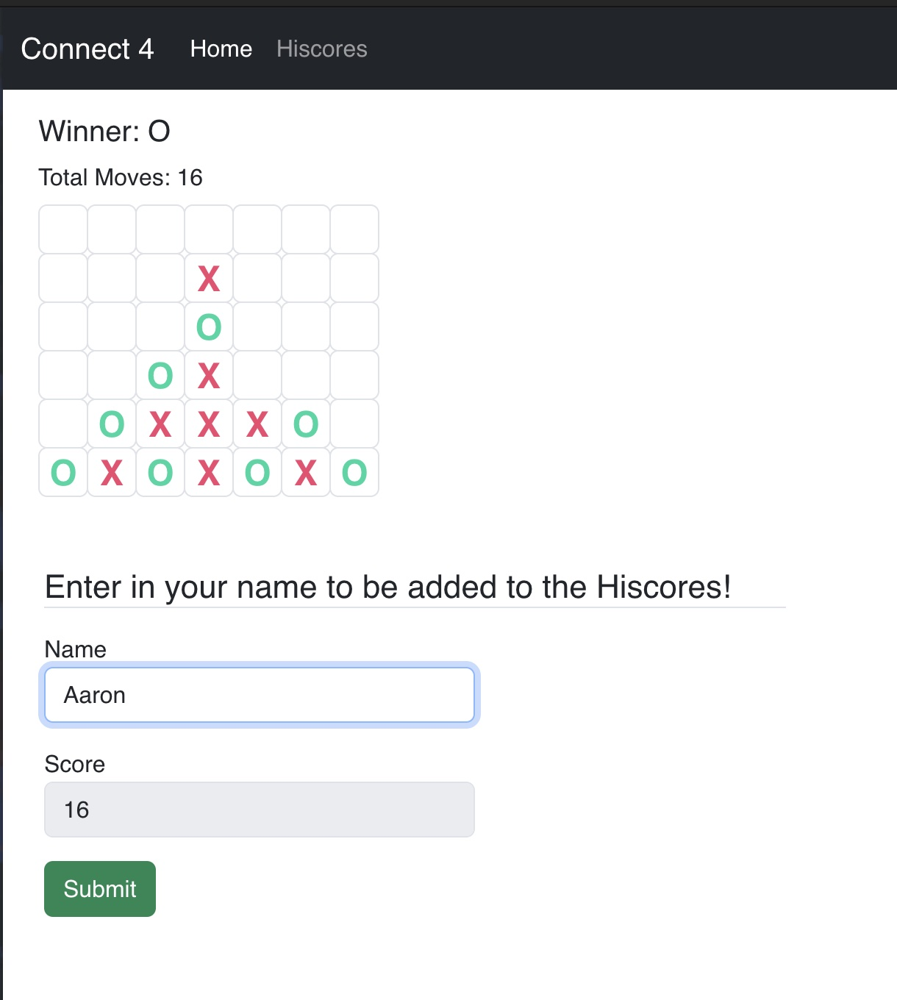
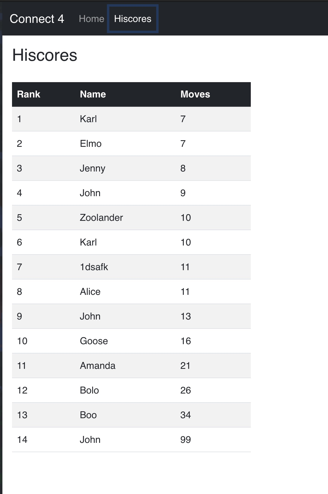

# Connect4

## CS 3750 Midterm

### Description

Using our newly aquired react skills, we made a simple connect 4 game that started out as a tic tac toe game, and then was converted into connect 4. The game implements a highscore table with a player able to submit their score to the high scores after a win happens.

### Technologies used

This Connect 4 game was built using the MERN stack meaning it used 

- MongoDB - Mongo's data store, where I stored the highscores
- Express.js - A backend Javascript framework that helped with API calls
- React - A frontend Javascript framework that allowed me to easily create the frontend web app.
- Node.js - A backend Javascript framework that allowed me to create the backend using Javascript code.

### Challenges

The challenges encountered in the connect 4 game were to figure out how to calculate the winning moves. This was solved by creating a hard coded list of all possible winning states.

Another Challenge was creating a way to submit to the server once a game finished and have the server add the final score to the list of high scores. This was accomplished by using fetch, as we hadn't been introduced to axios yet.

Lastly, the highscores table had to be shown in sorted order according to the moves made. The main question was where the sorting should take place. I learned that sorting on the server side is always preferrable so I went ahead and sorted and sent the sorted table from the server

### Screenshots

